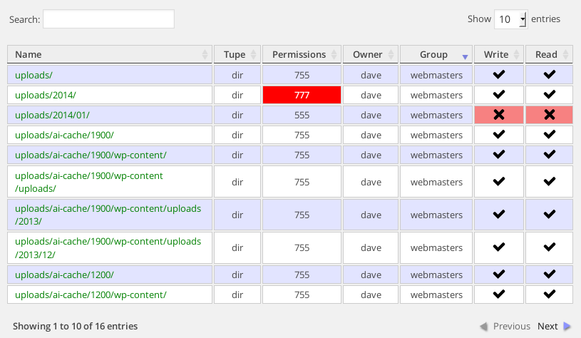

WP Upload Permissions
============================

### Display file permissions of a WordPress uploads directory tree.

This simple little plugin examines a WordPress uploads directory and displays all the directory
and file permissions in octal notation. 

I put it together with the intention of helping lost souls in the wordpress.org forums who are struggling
to upload media due to incorrect file permissions.  Using this plugin will aid debugging. 

#### Install

Upload the plugin to your plugins directory, activate it and view it in action in your Dashboard Media menu.

Wonder at its astonishing beauty.

#### Changelog

* _[v0.7.3]_ Changed the order of the table headers to Read - Write
             Check for is_readable improved
* _[v0.7.2]_ Typo fix
* _[v0.7.1]_ Moved menu entry to Media.  Seems more logical
* _[v0.7.0]_ Added TableTools to Datatables for CSV, Excel and PDF download
* _[v0.6.2]_ Needed to add closing PHP statement due to update plugin
* _[v0.6.1]_ Added default DataTables CSS rules + images.  Renamed some table headers
* _[v0.6.0]_ Added ability to select Just Directories, or both Directories and Files
* _[v0.5.0]_ Added owner/group details, included icons.  Changed name to WP Upload Permissions.
* _[v0.4.0]_ Moved to FileInfo for MIME type checking.
* _[v0.3.0]_ Now incorprates jQuery DataTables for pagination, filtering and sorting.
* _[v0.2.0]_ Prettify the output.  A table!  Colours!
* _[v0.1.0]_ Initial release

__Dave Naylor__

[WPRanger](http://wpranger.co.uk)
